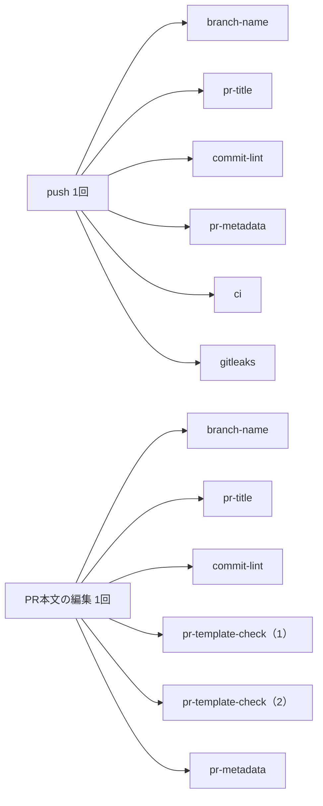
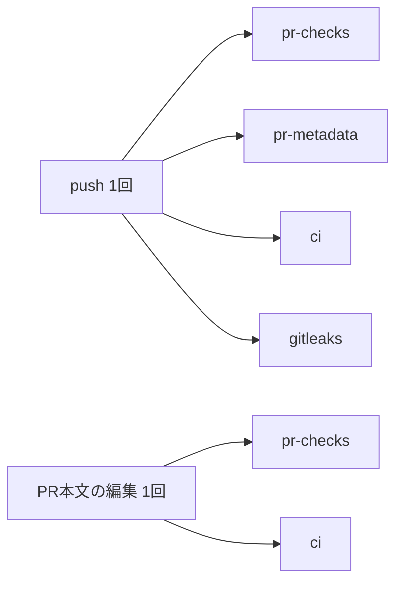

1on1の練習アプリ「キクレン」を共同で制作しています。実装担当は私で、Issueの起票からPR作成、レビュー、修正までの多くをAIエージェント（実装はClaude Code、レビューはCodex）に回してもらっています。

その結果、気づかないうちにGitHub Actionsの無料枠を使い切り、CIが止まりました。

AIでガンガン開発を進めていて、GitHub Actionsを無料プランで使っている人に向けて、同じ失敗をしないための注意喚起として書きます。

## 作っているもの

キクレンは、マネージャーが1on1の聞き方を音声で練習できるサービスです。ユーザーはマネージャー役として話しかけ、AIは悩みを抱えた部下を演じます。


_練習画面_

https://kikuren.com/?utm_source=zenn&utm_campaign=zenn03

## ある日、CIが全部止まった

ある日、同じorganizationにある全リポジトリのCIが、数秒で落ちるようになりました。理由はログには出ず、check runのannotationにだけ次のメッセージが残っていました。

```
The job was not started because recent account payments have failed or your spending limit needs to be increased.
```

支払いのトラブルに見えますが、実際は月2,000分の無料枠（GitHub Freeのorganization）を使い切って、支出上限に当たっていました。

## 何がそんなに分数を使っていたのか

GitHub Actionsは、ジョブごとに実行時間を1分に切り上げて課金します。数秒で終わる短いジョブでも、起動するたびに1分ずつ積み上がります。


_変更前のジョブ構成。箱1つが1ジョブで、課金上はそれぞれ最低1分_

そして、ジョブを起動していたのは主にAIエージェントの動きでした。

- レビュー用のエージェントは、レビューのたびにPR本文を更新します。`edited` を拾うworkflowが多く、本文が書き換わるたびに図の6ジョブが走っていました。
- エージェントのレビューループは、指摘を直してpushする往復を1つのPRで5〜10回繰り返します。`concurrency` を設定していなかったので、古いrunもキャンセルされずに全部最後まで走っていました。

AIの開発スピードに合わせて、Actionsの消費も膨らんでいました。

## AIは分数を気にしてくれない

振り返ると、これはAIに任せきりでは気づきにくい問題でした。

私はエージェントに、PR本文を1回更新するたびに数分の課金が発生することを伝えていませんでした。レビューのたびに本文を丁寧に更新し、指摘を受けたらすぐにpushするのは、エージェントとしてはむしろ正しい動きです。

さらに、エージェントからはBillingが見えません。BillingのAPIには `admin:org` の権限が要り、私たちはエージェントにBillingを読む経路を用意していませんでした。止まった後も、エージェントに分かるのは「CIが数秒で落ちている」ことと停止のメッセージまでで、無料枠があとどれだけ残っているかは見えません。

テストが落ちれば、エージェントにもすぐ分かります。でも、無料枠の残りはエージェントの視界の外にあります。ここは、人間が意識して見に行き、エージェントに制約として伝えないといけないところでした。

## 減らしても足りなかった

止まった後、エージェントと一緒にジョブの構成を直しました。規約の検査を `pr-checks` の1ジョブにまとめ、`edited` を拾うworkflowを絞り、検査系には `concurrency` を付けて古いrunをキャンセルするようにしています。


_変更後のジョブ構成_

2週間後に実行履歴から推定すると、1日あたりの消費は183.8分から92.0分に減りました（この間は開発量も減っていたので、全部が設定変更の効果ではありません）。ただ、それでも月換算で約2,760分で、無料枠をまだ超えていました。

計算してみると、構造的な上限もありました。私たちの構成では、検査の要件から削れない4ジョブが1コミットごとに走るので、ほかの消費をすべてゼロにできたとしても、無料枠に収まる開発量は 2,000分 ÷ 30日 ÷ 4ジョブ ＝ 1日約16.7コミットが上限です。変更前は1日21.7コミットでした。AIに任せるのはコミット数を増やしたいからなのに、無料枠は開発量そのものに上限をかけてきます。

## その後も、月の後半に止まっている

最初はすぐに復旧しましたが、その後も2か月続けて月の後半に枠が尽き、月替わりまでActionsがほぼ動かなくなりました。

私たちは、支出上限を上げずに、止まっている間はローカルの検査（`pre-push` フックで `nx affected -t lint typecheck test` を実行）でしのぐことにしました。ただ、これは良い状態ではありません。CIが赤いままマージするPRが当たり前になり、Actionsで動かしていたラベル付与やGitHub Projectsへの同期も一緒に止まります。

## 無料プランでAI開発をしている人へ

同じことにならないように、次の4つをおすすめします。

**1. 今月の使用量を、人間が自分で見に行く**

私たちの環境ではエージェントからBillingが見えないので、ここは人間が見に行くしかありません。Billingの画面を見るか、organizationなら次のAPIで分数を確認できます（`admin:org` スコープが必要です）。

```bash
gh api --paginate "/organizations/{org}/settings/billing/usage?year=2026&month=10" \
  --jq '[.usageItems[] | select(.product == "actions")] | group_by(.sku)
        | map({sku: .[0].sku, quantity: (map(.quantity) | add)})'
```

**2. 課金の仕組みを、エージェントへの指示に書く**

「ジョブ単位で1分に切り上げて課金される」「`edited` を拾うworkflowは、本文編集のたびに課金される」「検査系には `concurrency` を付ける」。私たちは方針をドキュメントに書いたうえで、workflowの設定を回帰テストで固定しました。

**3. 無料枠で回せる開発量を、先に計算しておく**

1コミットあたりで最低いくつジョブが走るかが分かれば、2,000 ÷ 30 ÷ ジョブ数 で、1日に回せるコミット数のおおよその上限が出ます。実際には1分を超えるジョブや本文編集の分があるので、これより少なくなります。AIで開発量を増やすつもりなら、その数字を見て、削減で粘るか、プランを上げるか、リポジトリを公開するか（publicリポジトリなら標準ランナーは無料です）を早めに決めておくのが良いと思います。

**4. そもそもActions（CI）でやる必要があるか考え直す**

ブランチ名やPRタイトルの規約チェックのような軽い検査は、`pre-push` フックやエージェントの手順に移せます。止まっている間、私たちの開発はローカルの検査で回っていました。

私たちは、その判断を先延ばしにしたまま、月の後半に止まり続けています。この記事が、同じような開発をしている人の注意喚起になればうれしいです。
