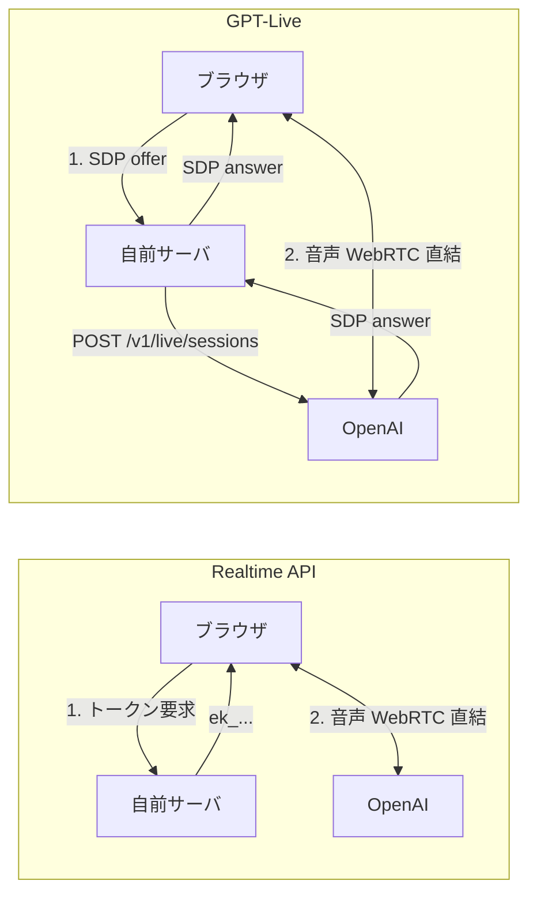

1on1の練習アプリ「キクレン」で、相談者役の音声AIを実装しています。この記事は、相談者役の音声AIのバックエンドをOpenAIのRealtime APIから、[2026年9月10日にAPIでGAになった](https://developers.openai.com/api/docs/changelog)GPT-Live（`gpt-live-1`）へ切り替えたときの記録です。

Realtime APIのときは、ユーザーが相づちを打つたびにAIの話が止まる問題をずっと直せずにいて、GPT-Liveに切り替えたらこれが出なくなりました。そのために書いていた回避処理もいらなくなっています。ただ、ターン検出の設定や発話の開始・終了イベントがなくなるので、その部分は自分たちで作り直しました。プロンプトも短くできると思っていたのですが、こちらは結局そのままです。

Realtime APIで音声対話を作っていて移行を考えている人、特に日本語で、AIに何かを演じさせる用途の人に向けて書きます。

# 作っているもの

キクレンは、マネージャーが1on1の聞き方を音声で練習できるサービスです。ユーザーはマネージャー役として話しかけ、AIは悩みを抱えた部下を演じます。

*練習画面。相談者AIが話している間は、名前の下の波形が動きます*

https://kikuren.com/?utm_source=zenn&utm_campaign=zenn02

このAIには、聞かれたことにすぐ答えるのではなく、こちらの聞き方によって話す量が変わってほしいと思っています。うなずいて待っていれば続きを話すし、急かすと話さなくなる、そういう相手です。普通の音声アシスタントは黙ったらすぐ答えるのが正義ですが、こっちは逆で、相づちや割り込みにどう反応するかがそのまま練習の質になります。

# Realtime APIで困っていたこと

切り替え前は `gpt-realtime-2.1` を使っていて、次の3つの問題を抱えていました。

1つ目は、ユーザーが「うんうん」と相づちを打つと、相談者AIの発話がそこで止まってしまうことです。こちらが何か言うたびに相手が止まる、完全にターン制のやり取りになり、うなずきながら聞くという、傾聴でいちばん基本の動きが練習できません。これは最後まで直しきれず、GPT-LiveがAPIで使えるようになったら解決する見込みで、仕様として残していました。

2つ目は、遮られたあとに続きを話すのではなく、一段深い本音を新しく打ち明けてしまうことです。「続けてください」と言っただけで自己開示が進んでしまうので、待っているだけで心が開く相手になり、練習として成り立たなくなります。これは2段構えで抑えていました。割り込んだ位置でサーバ側の履歴を切り詰める処理（`conversation.item.truncate`）と、遮られたら続きだけを話すというプロンプトのルールです。

3つ目は、雑音をきっかけに、誰も話していないのにAIが話し出すことです。VADが雑音を発話と判定するのが原因で、サーバVADの自動応答を切り（`create_response: false`）、文字起こしが届いたときだけ `response.create` を送る制御で対処していました。

そこへGPT-LiveのGAが来ました。[OpenAIの発表](https://openai.com/index/introducing-gpt-live-1-in-the-api/)では、相づちや割り込みへの反応を測るベンチマーク（Full Duplex Bench v1.5 Interactivity）が、`gpt-realtime-2.1` の45.4%に対して80.10%でした。相手の発話が終わってから応答を始めるまでの時間（同v1 Turn-taking latency）も、1.41秒に対して0.798秒です。ちょうど困っていた箇所の数字だったので、翌日から調べ始めました。

# GPT-Liveに移行して良くなったこと

## 相づちで話が止まらなくなった

GPT-Liveで初めて話したとき、とにかくリアルだと感じました。Realtime APIのときは、こちらが「うん」と言うたびに相手の話が止まっていましたが、GPT-Liveではうなずきながら聞いていても相手が話し続けます。人と話しているときの感覚にかなり近づいたと思います。

心配していた日本語も問題ありませんでした。公式は日本語対応を明言しておらず、追加された音声も英語系とブラジルポルトガル語だけだったので不安でしたが、Realtime APIで使っていた音声 `cedar` をそのまま指定して、自然な日本語で話してくれました。相談者の演技も、むしろ良くなったと感じています。

## 回避処理を持たなくてよくなった

これに合わせて、GPT-Live側では次の2つを持たないことにしました。

- 割り込みのたびにサーバ側の履歴を切り詰める処理。full-duplexではモデル側が扱う前提で、対応するクライアントイベントもありません
- 文字起こしの到着を待って `response.create` を送る制御。GPT-Liveの `response.create` は、バックエンドへ委譲した処理を始めたり、関数の実行結果を返したあとに続けさせたりするためのもので、こちらから応答を起こすトリガーではありません

撤去したあとにもう一度セッションを張り、相づちで遮ったあとの続き、雑音への反応、考えている間への割り込みの3点を確かめて、問題は出ませんでした。周りで音楽が鳴っていて、スピーカー再生で相談者の声がマイクに回り込みうる条件です。確かめたのは1セッション分です。

相づちの文字起こしも変わりました。Realtime APIでは「うん」のような短い相づちが `Mhm.` や `음.` に化けることがあり、日本語の文字を含まないものとして落とすガードを入れていました。GPT-Liveでは同じ類の相づちが全部日本語のまま残りました。GPT-Live側では、文字の種類を見るチェックだけ残して小さくしました。発話区間と照合していたほうは、照合する相手のイベントがないので外しています。文字種チェックは、外していいと言えるほど回数を見ていないので残しました。

## コストがぶれなくなった

Realtime APIはトークン単位の課金で、毎ターン会話全体をモデルに送るため、会話が進むほど入力が積み上がります。プロンプトキャッシュが効けば大きく下がりますが保証はなく、割り込みのたびに履歴を切り詰めていた実装では、その地点から後ろのキャッシュが捨てられる仕組みでした。

GPT-Liveは秒単位の課金で、単価は$0.05/分です。話していても黙っていても同じで、文字起こしもセッション料金に含まれます。

10分の練習で試算すると、Realtime APIは約$0.41から約$5.03の間、GPT-Liveは$0.50でした。前提はユーザーの発話4分・AIの発話3分・無音3分・40ターン・instructions約5,000 tokenで、Realtime API側は `gpt-realtime-2.1` の公開単価で計算しています。下限の約$0.41は入力がすべてキャッシュ単価で乗った場合の理論値で、実際にはこの間のどこかに落ちます。

実測では406秒のセッションが約$0.34で、試算どおりでした。劇的に安くなったわけではなく、Realtime APIでキャッシュがうまく効いたときと同じくらいの額です。ただ、それがプロンプトの長さやキャッシュの当たり外れに関係なく毎回そうなる、というところが助かっています。

# 気をつけること

## 定数の差し替えでは移行できない

モデル名の定数を差し替えて済む話ではなく、ブラウザとサーバとOpenAIのつなぎ方から変わります。

| | Realtime API | GPT-Live |
| --- | --- | --- |
| ブラウザに渡すもの | ephemeral token（`ek_...`） | なし。サーバが中継したSDP answerだけ |
| ターン検出 | `turn_detection` で設定 | 設定項目がない。いつ話すかはモデルが決める |
| 文字起こし | モデルと言語（`ja`）を指定できる | 設定項目がない。言語ヒントも渡せない |
| 発話の開始・終了イベント | ある | ない |

これまでトークンを1回発行したあとは関与しなかったサーバが、セッションを作るたびにSDPを中継する形になります。音声そのものは今までどおりブラウザとOpenAIの直結なので、サーバが生の音声を持たない前提は崩れません。その代わり、ターン検出・文字起こし・発話イベントの上に積んでいた処理は移植できず、消すか作り直すかを1つずつ決めることになります。

## 発話中の表示は、音量から自分で作る

練習画面には、今どちらが話しているかの表示があります。Realtime APIでは、サーバが出すイベント（ユーザー側は `input_audio_buffer.speech_started` などのVADのイベント、AI側は `output_audio_buffer.started` などの再生のイベント）から作っていましたが、GPT-Liveにはそれに対応するイベントがなく、移行ガイドにも再生状態から作るように書かれています。

相手側はWebRTCのリモート音声トラック、自分側はマイクの入力を、それぞれWeb Audioの `AnalyserNode` に通して振幅を読み、そこから判定するように作り直しました。判定の材料が実際に鳴っている音になったので、Realtime API側も同じ判定で動きます。full-duplexでは両方が同時に話している状態が普通に起きるので、どちらかを勝たせずに2つの独立した判定として持っています。

## ターンの区切りは、断片の間隔から自分で作る

GPT-Liveの文字起こしは `session.input_transcript.delta` の断片で、1語ずつ届きます。発話ごとの確定イベントはなく、ターンの区切りは自分で作る必要があります。区切る条件は、断片同士の間隔と、相手の声が重なったとき（割り込み）の2つにしました。まず間隔のほうを決めるために、断片にイベントのトップレベルで付く `start_ms` と `end_ms` から、断片同士の間隔を1セッション分測りました。

| 断片同士の間隔 | 回数 | 中身 |
| --- | --- | --- |
| 0〜800ms | 79 | すべて同じ発話の中 |
| 1,000〜2,000ms | 5 | これも同じ発話の中 |
| 3,400ms以上 | 9 | ターンの境目 |

1秒空いたら区切るという規則では、2秒の無音を含む1つの発話を割ってしまいます。区切りの閾値は、この表で空いている範囲に置いて3,000msにしました。

それでも1つの発話が2ターンに割れることがあり、12セッション分のログ（ユーザー987断片、相談者2,408断片）で原因を調べました。間隔で切った境界に誤りはなく、誤って切れた26件はすべて、割り込みのほうのルールのせいでした。1つの発話の中には200〜800msの無音が必ず並び、full-duplexではそこに相手の声が普通に重なります。そこで、900ms以上の無音があって、かつその間に相手の声が重なったときだけ区切る、という下限を足しました。どちらの値も1人分の少ないログから決めたので、別の人の声だと変わると思います。

## 文字起こしに非言語タグが混ざることがある

GPT-Liveの入力文字起こしには、息づかいや咳払いが `[breath]` や `[clear throat]` のようなタグで混ざることがありました。まだ1セッションでしか見ていません。そのままだと、評価画面に出す会話の引用に `[breath]` が出てしまいます。

困ったのは、閉じ括弧が数秒遅れて別の断片として届いたことです。前のターンの末尾に `[clear throat`、次のターンの先頭に `]` が分かれて残るので、組み立てたターンの本文から消そうとしても消し切れません。ターンに組み立てる前の、断片を届いた順につないだ文字列に対して取り除くようにしています。

## プロンプトのルールは、1つも削れなかった

Realtime API時代、相談者AIのinstructionsには音声向けの追加ルールを足していました。1回の発話は1〜2文にする、相づちだけなら深い話を続けない、遮られたら続きだけを話す、といったターンテイキングの規律で、全部で1,038文字あります。

GPT-Liveのプロンプトガイドは、Realtimeから移行するときはまず簡単なプロンプトから始めて、どの規則がまだ必要かを試すよう勧めています。相づちや割り込みがうまくなった分、規律もいくつかは外せると思っていました。

そこで、ルールを全部外した条件と全部載せた条件で、良い聞き方、下手な聞き方、相づちだけで待つ、の3場面を話して比べました。全部外すと、相談者は最初からなめらかに長く話し、言いよどみも減って、きれいすぎる話し方に戻りました。ログで相談者のいちばん長いターンの文字数を比べると次のとおりです。

| 場面 | 全部外した | 全部載せた |
| --- | --- | --- |
| 良い聞き方 | 175 | 118 |
| 下手な聞き方 | 85 | 47 |
| 相づちだけで待つ | 76 | 24 |

平均の長さは場面によって逆転するので、平均だけを見ていたら効果がないように見えたと思います。効いていたのは、いちばん長いターンのほうでした。

続けて、差が出たルールを1つずつ戻しました。発話の長さのルールを戻すと、良い聞き方の場面の最長ターンが175文字から121文字になりました。言いよどみのルールを戻すと、「あのー」のような言いよどみが千字あたり8.3回から15.4回に増え、文法がきれいすぎない自然な話し方になりました。比べたのは全部で8セッションで、条件と場面の組み合わせごとに1セッションずつです。

残りのルールは単独では測っていません。差が出なかったからいらない、とは言えないので載せたままです。遮られたら続きを話すというルールは、Realtime APIのときに履歴の切り詰めと組み合わせて2つ目の問題を抑えていたものです。GPT-Liveで履歴の切り詰めは不要になりましたが、こちらのルールは外す根拠が得られず、残しています。

結局、外してよいと言えるルールは1つもなく、今もGPT-Live側に同じ全文を載せています。

一方で、全部載せた条件でも、下手な聞き方や相づちだけで待ったときに相談者が深い話まで打ち明けてしまう問題は残りました。話す量は追加ルールで抑えられても、どこまで打ち明けるかはinstructionsの文言だけでは決まらないようです。モデルを差し替えるだけで解けるとは考えていないので、プロンプトとは別のところで対処するつもりです。

# まとめ

Realtime APIで相づちのたびに話が止まる問題を抱えていたなら、GPT-Liveへの移行はかなり効くと思います。私たちの場合は、うなずきながら聞いても相手が話し続けるようになり、そのための回避処理もいらなくなりました。コストも秒課金で読みやすくなっています。

ただし移行は作り直しに近く、発話中の表示やターンの区切りは自分で作ることになります。文字起こしは1語ずつの断片で届き、1つの発話の中にも2秒の無音があります。それから、モデルの改善でプロンプトが短くなることを期待していたなら、そこは実際に外して測ってみるのをおすすめします。私たちの場合は結局そのままになりました。

日本語での事例はまだ少ないと思うので、移行を考えている人の参考になればうれしいです。

# 参考

- [OpenAI API Changelog（2026-09-10 GPT-Live 1 の GA）](https://developers.openai.com/api/docs/changelog)
- [Build more natural voice experiences with GPT-Live-1 in the API（OpenAI）](https://openai.com/index/introducing-gpt-live-1-in-the-api/)
- [Migrate to GPT-Live](https://developers.openai.com/api/docs/guides/live-migration)
- [Prompting GPT-Live](https://developers.openai.com/api/docs/guides/live-prompting)
- [GPT-Live 1（モデルページ・料金）](https://developers.openai.com/api/docs/models/gpt-live-1)
